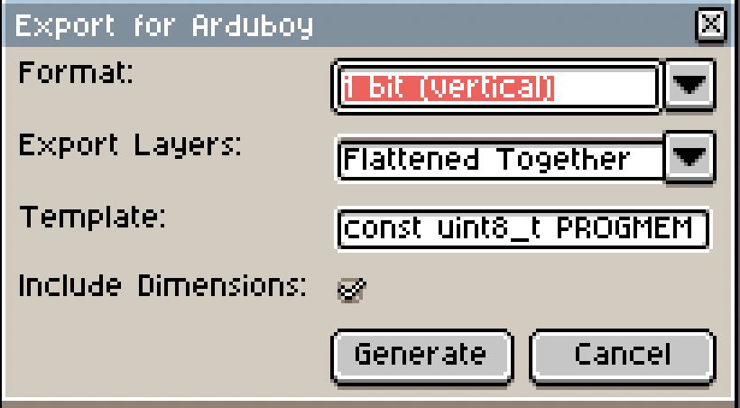

# arduboy-aseprite

Aseprite extension for exporting sprites to C data, specifically in [Arduboy](https://www.arduboy.com) format.

## Installation

Header over to the Releases section and download the latest `.aseprite-extension` file. Then, double click it to install in aseprite!

> Note: You will probably have to restart Aseprite after installation.

## Usage

Use _File -> Export as C Array_ to export the current sprite / frame as C code.

After hitting Generate, your C code will come up in a dialog. **To copy the text from this dialog, click the text portion and use your OS shortcut key for copying to the clipboard.**

### Format

- **1 bit (horizontal)**  
  Data is stored horizontally with each byte representing 8 columns of pixels. 
  _Note: Any color under mid-gray will be a 0 bit, otherwise a 1 bit._
- **1 bit (vertical)**  
  Data is stored in the Arduboy format, with each byte representing 8 vertical pixels. 
  _Note: Any color under mid-gray will be a 0 bit, otherwise a 1 bit._
- **8 bit (indexed)**  
  Data is stored using the palette index of the pixel. Each pixel consumes 1 byte.
- **32 bit (RGBA)**  
  Data is stored in RGBA format, where each 4 bytes represent the red, green, blue, and alpha components.

### Export Layers

- **Individually**  
  Each layer, whether it is hidden or not, gets generated as it's own C array.
- **Flattened Together**  
  The entire sprite is converted to a single C array, as if the layers have been flattened.

  ### Template

  You can customize the template used to generate the variable C array.  The string `NAME` will get converted into a friendly name.

  ### Include Dimensions

  If checked, the first two bytes of the array will be width and height of the sprite.

  **Note: If the layer being processed has the work "mask" in it's name, the dimensions will NOT be included.**